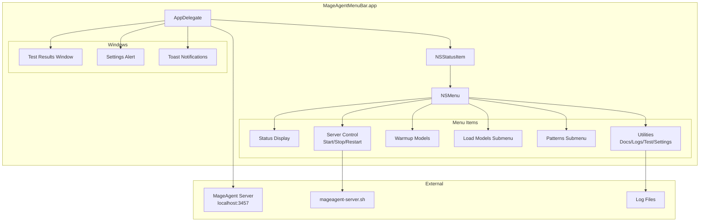

# MageAgent Architecture Diagrams

## System Overview


## Menu Bar App Architecture



## Pattern Flow Diagrams

### Execute Pattern (ReAct Loop)


### Validated Pattern


### Compete Pattern


## Model Memory Layout


## Installation Flow


## API Endpoints

```mermaid
graph LR
    subgraph "OpenAI-Compatible API"
        H[/health]
        M[/v1/models]
        C[/v1/chat/completions]
    end

    subgraph "Response Format"
        H --> |JSON| HS[status, loaded_models]
        M --> |JSON| MS[model list]
        C --> |JSON/SSE| CS[chat completion]
    end
```
